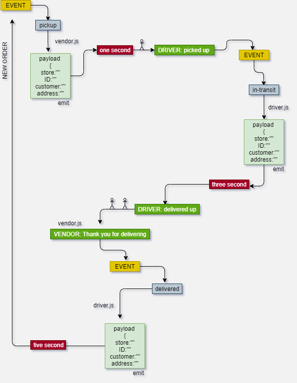

# Event Driven Applications
 build out a system that emulates a real world supply chain. CAPS will simulate a delivery service where vendors (such a flower shops) will ship products using our delivery service and when our drivers deliver them, be notified that their customers received what they purchased.

Tactically, this will be an event driven application that “distributes” the responsibility for logging to separate modules, using only events to trigger logging based on activity.


### Phase 1 
setup a system of events and handlers, with the intent being to change out the eventing system as we go, and keeping the handlers themselves largely the same. 


## CAPS system :

**events.js** - Global Event Pool 
caps.js - Main Hub Application
Manages the state of every package
Logs every event to the console with a timestamp and the event payload

**vendor.js** - Vendor Module
Every 5 seconds, simulate a new customer order

Monitor the system for events …
Whenever the ‘delivered’ event occurs
“thank you” logged to the console


**driver.js** - Drivers Module
Monitor the system for events …
On the ‘pickup’ event …
Wait 1 second
Log “DRIVER: picked up [ORDER_ID]” to the console.
Emit an ‘in-transit’ event with the payload you received
Wait 3 seconds
Log “delivered” to the console
Emit a ‘delivered’ event with the same payload


## console output :


```js
EVENT { event: 'pickup',
  time: 2020-03-06T18:27:17.732Z,
  payload:
   { store: '1-206-flowers',
     orderID: 'e3669048-7313-427b-b6cc-74010ca1f8f0',
     customer: 'Jamal Braun',
     address: 'Schmittfort, LA' } }
DRIVER: picked up e3669048-7313-427b-b6cc-74010ca1f8f0
EVENT { event: 'in-transit',
  time: 2020-03-06T18:27:18.738Z,
  payload:
   { store: '1-206-flowers',
     orderID: 'e3669048-7313-427b-b6cc-74010ca1f8f0',
     customer: 'Jamal Braun',
     address: 'Schmittfort, LA' } }
DRIVER: delivered up e3669048-7313-427b-b6cc-74010ca1f8f0
VENDOR: Thank you for delivering e3669048-7313-427b-b6cc-74010ca1f8f0
EVENT { event: 'delivered',
  time: 2020-03-06T18:27:20.736Z,
  payload:
   { store: '1-206-flowers',
     orderID: 'e3669048-7313-427b-b6cc-74010ca1f8f0',
     customer: 'Jamal Braun',
     address: 'Schmittfort, LA' } }
<------------------------- NEW ORDER ------------------------->
EVENT {
  event: 'pickup',
  time: '2021-05-31T18:4:35:50Z',
  payload: {
    store: '1-206-flowers',
    orderID: '31f679ad-3e6d-4d91-a215-9a9b8b64c20b',
    customer: 'Timmy Effertz IV',
    address: 'Normal'
  }
}
DRIVER: picked up 31f679ad-3e6d-4d91-a215-9a9b8b64c20b
EVENT {
  event: 'in-transit',
  time: '2021-05-31T18:4:35:50Z',
  payload: {
    store: '1-206-flowers',
    orderID: '31f679ad-3e6d-4d91-a215-9a9b8b64c20b',
    customer: 'Timmy Effertz IV',
    address: 'Normal'
  }
}
DRIVER: delivered up 31f679ad-3e6d-4d91-a215-9a9b8b64c20b
VENDOR: Thank you for delivering 31f679ad-3e6d-4d91-a215-9a9b8b64c20b
EVENT {
  event: 'delivered',
  time: '2021-05-31T18:4:35:50Z',
  payload: {
    store: '1-206-flowers',
    orderID: '31f679ad-3e6d-4d91-a215-9a9b8b64c20b',
    customer: 'Timmy Effertz IV',
    address: 'Normal'
  }
}
...
```

## Tests :

```
 PASS  __tests__/CAPS.test.js (6.816 s)
  testing event handlers
    ✓ call pickup package  (2 ms)
    ✓ call in-transit package
    ✓ call delivered package (1 ms)

-----------|---------|----------|---------|---------|-------------------
File       | % Stmts | % Branch | % Funcs | % Lines | Uncovered Line #s
-----------|---------|----------|---------|---------|-------------------
All files  |     100 |      100 |     100 |     100 |
 events.js |     100 |      100 |     100 |     100 |
-----------|---------|----------|---------|---------|-------------------
Test Suites: 1 passed, 1 total
Tests:       3 passed, 3 total
Snapshots:   0 total
Time:        8.217 s
```

[Go To Actions](https://github.com/wafaankoush99/CAPS/actions)

***

### UML Diagram



